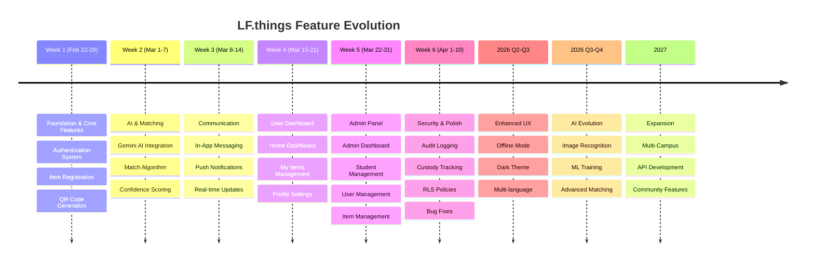
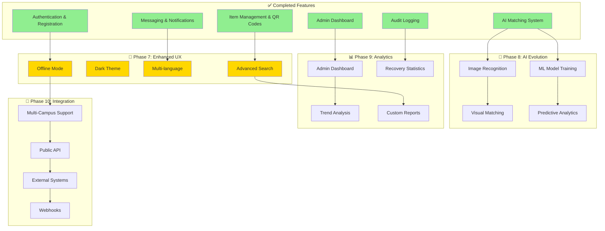

# LF.things - Product Roadmap

## Overview

This roadmap documents the development journey of LF.things, a Lost & Found management system for CTU Daanbantayan campus, and outlines future enhancements to improve functionality, user experience, and system reliability.

---

## 📅 Visual Timeline

```mermaid
gantt
    title LF.things Development Roadmap
    dateFormat YYYY-MM-DD
    section Completed (Feb 23 - Apr 10, 2026)
    Phase 1: Foundation           :done, p1, 2026-02-23, 2026-03-01
    Phase 2: AI Matching          :done, p2, 2026-03-01, 2026-03-08
    Phase 3: Communication        :done, p3, 2026-03-08, 2026-03-15
    Phase 4: User Dashboard       :done, p4, 2026-03-15, 2026-03-22
    Phase 5: Admin Panel          :done, p5, 2026-03-22, 2026-04-01
    Phase 6: Security & Polish    :done, p6, 2026-04-01, 2026-04-10
    section Future
    Phase 7: Enhanced UX          :active, p7, 2026-05, 2026-09
    Phase 8: AI Improvements      :p8, 2026-07, 2026-12
    Phase 9: Analytics            :p9, 2026-10, 2027-01
    Phase 10: Integration         :p10, 2027-01, 2027-06
    Phase 11: Community           :p11, 2027-04, 2027-09
    Phase 12: Advanced Admin      :p12, 2027-07, 2027-12
```



---

## 📜 Historical Development (Completed)

**Development Period:** 20 Days / 7 Weeks of Active Development  
**Report Date:** April 13, 2026  
**Completion Status:** 11/15 Features (73.3%)

### Week 1: Planning & Project Pivot (Days 1-3)

#### Day 1: Project Kickoff
- ✅ Initial concept: Event Attendance System
- ✅ Feature proposals and team role assignments
- ✅ Database and frontend work started in parallel

#### Day 2: Critical Discovery
- ✅ Identified fundamental integrity flaw in attendance system
- ✅ Software-only attendance vulnerable to proxy fraud
- ✅ Brainstorming session for alternative projects
- ✅ Four alternatives proposed: Lost & Found, Queue Management, E-commerce, Trading/Marketplace

#### Day 3: Project Pivot Decision
- ✅ Team voted to pivot to Lost & Found application
- ✅ AI-powered matching and QR code scanning added as differentiators
- ✅ Full feature planning conducted
- ✅ Supabase selected as backend
- ✅ VS Code confirmed as development environment

### Week 2: UI Design & Initial Development (Days 4-6)

#### Day 4: UI/UX Design
- ✅ Color scheme, icons, and avatar selection
- ✅ Hand-drawn wireframes created collaboratively
- ✅ Visual alignment established before coding

#### Day 5: Frontend Development
- ✅ Frontend development initiated by designated team member
- ✅ Initial screen components and layout structure coded
- ✅ Frontend-first approach while backend schema finalized

#### Day 6: Backend Integration
- ✅ Frontend integrated with Supabase backend
- ✅ Database connections established
- ✅ Data-fetch hooks implemented
- ✅ Early integration to surface schema mismatches

### Week 3: Core Features & Scope Expansion (Days 7-9)

#### Day 7: Full App Integration
- ✅ Login and registration system
- ✅ Authentication flow complete
- ✅ Home screen functional
- ✅ Profile screen implemented
- ✅ All primary screens connected to Supabase
- ✅ Core navigation and auth flow end-to-end

#### Day 8: Web Interface Support
- ✅ Codebase adapted for web interface
- ✅ Responsive adjustments for mobile and browser
- ✅ Same application logic across platforms

#### Day 9: Admin Panel Scoped
- ✅ Team identified need for admin panel
- ✅ SSG Office custody tracking requirement
- ✅ Admin features planned and scoped
- ✅ Prevents returned items from disappearing from system

### Week 4: Critical Sprint & Major Bug (Days 10-12)

#### Day 10: Most Challenging Day
- ✅ Notification/alert system development
- ⚠️ AI matching feature encountered critical bug
- ⚠️ Bug cascaded across multiple screens
- ✅ Affected code isolated in separate project folder
- ✅ Containment strategy prevented further damage

#### Day 11: Recovery Day
- ✅ Deliberate pause after Day 10 crisis
- ✅ Team recovery and discussion
- ✅ Workarounds brainstormed for AI bug
- ✅ Additional features considered for future

#### Day 12: QR Code Development
- ✅ AI matching set aside temporarily
- ✅ QR code generation implemented
- ✅ QR code scanning functionality added
- ✅ Strategic pivot to maintain momentum

### Week 5: Testing, Debugging & Faculty Review (Days 13-15)

#### Day 13: Full Codebase Cleanup
- ✅ Systematic testing of all features
- ✅ Every button, screen, and alert tested
- ✅ Logical correctness verified (not just surface functionality)
- ✅ Several "appears to work" issues found and flagged

#### Day 14: Continued Debugging
- ✅ Multiple issues identified and resolved
- ✅ Various screens and interaction flows fixed
- ✅ Technical debt addressed

#### Day 15: Faculty Review
- ✅ Formal progress review with faculty adviser
- 📝 Recommendation: Rename misleading terminology
- 📝 Recommendation: Add Terms & Conditions screen
- ✅ Feedback documented for implementation

### Week 6: Stability Pass (Day 16)

#### Day 16: Quality Check
- ✅ Project leader debugging review
- ✅ Minor but notable issues identified
- ✅ Codebase brought to cleaner state
- ✅ Proactive quality check between sprints

### Week 7: AI Model Switch & Midterm Prep (Days 17-20)

#### Day 17: AI Matching Resumed
- ✅ Additional debugging on current progress
- ✅ AI matching development resumed
- ✅ Fresh perspective after extended break

#### Day 18: AI Refinement
- ⏳ Active development of AI matching continued
- ⏳ Matching logic refinement in progress
- ⏳ Outstanding issues from earlier bug addressed

#### Day 19: Critical Model Pivot
- ✅ Decision to abandon original AI model
- ✅ Switched to Groq API as AI backend
- ✅ Better performance and flexible querying
- ✅ Integration of new model began

#### Day 20: Midterm Consolidation
- ✅ Progress review and consolidation
- ⏳ AI matching development set aside for midterms
- ⏳ Terms & Conditions screen implementation started
- ✅ Lower-risk task addressing faculty feedback

---

## 📊 Feature Status Summary (Day 20)

| # | Feature / Module | Status |
|---|------------------|--------|
| 1 | User Authentication (Login/Register) | ✅ Completed |
| 2 | Home Screen | ✅ Completed |
| 3 | Profile Screen | ✅ Completed |
| 4 | Lost Item Reporting | ✅ Completed |
| 5 | Found Item Reporting | ✅ Completed |
| 6 | Item Listing & Browsing | ✅ Completed |
| 7 | QR Code Generation | ✅ Completed |
| 8 | QR Code Scanning | ✅ Completed |
| 9 | Notification/Alert System | ✅ Completed |
| 10 | Web Interface Support | ✅ Completed |
| 11 | Admin Dashboard | ✅ Completed |
| 12 | AI Item Matching (Groq API) | ⏳ In Progress |
| 13 | Terms and Conditions Screen | ⏳ In Progress |
| 14 | App Naming & Terminology Corrections | ⏳ In Progress |
| 15 | Full End-to-End Testing | ⏳ Ongoing |

**Progress:** 11/15 Features Completed (73.3%)

---

## 🚧 Key Challenges Overcome

### Challenge 1: Fundamental Project Pivot (Days 1-3)
**Issue:** Original event attendance concept had inherent integrity flaw - software-only solution vulnerable to proxy fraud.

**Resolution:** Team proactively identified the issue before substantial code investment. Clean pivot to Lost & Found concept with AI matching and QR scanning as differentiators.

**Impact:** Three-day planning period prevented months of work on a fundamentally flawed system.

### Challenge 2: AI Matching Bug Cascade (Day 10)
**Issue:** AI matching feature introduced bug that propagated beyond its module and corrupted unrelated screens.

**Resolution:** Isolated affected code in separate project folder to contain damage. Prevented further corruption of stable features.

**Impact:** Set back AI matching timeline significantly. Required recovery day (Day 11) for team.

### Challenge 3: AI Model Limitations (Days 17-19)
**Issue:** Original AI model proved inadequate for item-matching use case after multiple implementation attempts.

**Resolution:** Switched to Groq API on Day 19 for better performance and flexible querying capabilities.

**Impact:** Extended AI matching timeline but expected to produce more reliable and accurate system.

### Challenge 4: Mid-Development Scope Additions
**Issue:** Web interface (Day 8) and admin dashboard (Day 9) added after initial planning.

**Resolution:** Both features implemented without disrupting core development track.

**Impact:** Additional development surface managed through team adaptability.

---

## 🎯 Current Status (April 13, 2026)

The application has reached 73.3% completion with 11 of 15 planned features fully functional. The system is operational with:

- ✅ Complete authentication and user management
- ✅ Full item registration and reporting system
- ✅ QR code generation and scanning
- ✅ Notification system
- ✅ Admin dashboard for SSG Office
- ✅ Web and mobile interface support
- ⏳ AI matching integration in progress (Groq API)
- ⏳ Terms & Conditions screen in development
- ⏳ Final testing and polish ongoing

---

#### Home Dashboard
- ✅ Personalized greeting with first name
- ✅ Real-time statistics (lost items, safe items, matches)
- ✅ Quick action buttons (I Lost Something, I Found Something, Scan QR)
- ✅ Recent activity feed
- ✅ Mark items as lost modal

#### My Items Management
- ✅ View all registered items
- ✅ Filter by status (All, Safe, Lost, Found)
- ✅ Item cards with photos
- ✅ Status update functionality
- ✅ QR code viewing
- ✅ Item deletion
- ✅ Real-time updates

#### Profile & Settings
- ✅ Display name editing
- ✅ Bio management (120 char limit)
- ✅ Avatar selection (20 preset options)
- ✅ Account information display
- ✅ Sign out functionality

### Phase 5: Admin Panel & Oversight
**Timeline:** Week 5 (Mar 22-31, 2026)

#### Admin Dashboard
- ✅ System statistics overview
- ✅ Total users, items, matches counts
- ✅ Recent activity feed
- ✅ Quick action navigation
- ✅ Real-time data updates

#### Student Management
- ✅ Master student list management
- ✅ Add students (individual and bulk)
- ✅ Edit student information
- ✅ Student status management (active/inactive/graduated)
- ✅ CSV import functionality
- ✅ View linked auth accounts
- ✅ Student ID format validation

#### User Management
- ✅ View all registered users
- ✅ User profile information display
- ✅ Linked student ID verification
- ✅ User activity tracking
- ✅ Account status management

#### Item Management
- ✅ View all registered items system-wide
- ✅ Filter by status (safe, lost, found)
- ✅ Item details with photos
- ✅ Owner information display
- ✅ Item status updates
- ✅ Item deletion capability

#### Custody Log Management
- ✅ Track items in SSG Office custody
- ✅ Check-in/check-out functionality
- ✅ Custody status tracking
- ✅ Timestamp recording
- ✅ Admin notes for each custody event
- ✅ Historical custody records

#### Audit Logging System
- ✅ Comprehensive activity tracking
- ✅ User action logging (login, registration, profile updates)
- ✅ Item action logging (create, update, delete, status changes)
- ✅ Match action logging (create, confirm, reject)
- ✅ Admin action logging (student management, user management)
- ✅ Custody action logging (check-in, check-out)
- ✅ Filterable audit log viewer
- ✅ Export audit logs functionality
- ✅ IP address and user agent tracking

### Phase 6: Security & Data Integrity
**Timeline:** Week 6 (Apr 1-10, 2026)

#### Security Features
- ✅ Row Level Security (RLS) policies on all tables
- ✅ Student ID verification before registration
- ✅ Admin role-based access control
- ✅ Secure token generation for QR codes
- ✅ Input validation and sanitization
- ✅ SQL injection prevention
- ✅ XSS protection

#### Data Integrity
- ✅ Foreign key constraints
- ✅ Cascade delete policies
- ✅ Timestamp tracking (created_at, updated_at)
- ✅ Data validation at database level
- ✅ Unique constraints on critical fields

---

## 🚀 Current Status (April 2026)

The application is fully functional with all core features implemented. The system is deployed and operational at CTU Daanbantayan campus with:

- Active user base of enrolled students
- Comprehensive admin oversight tools
- AI-powered matching system
- Real-time notifications and messaging
- Full audit trail for accountability

---

## �️ Feature Roadmap Overview



---

## 🔮 Future Enhancements

### Phase 7: Enhanced User Experience (Q2-Q3 2026)

#### Mobile App Improvements
- [ ] Offline mode support for viewing registered items
- [ ] Improved photo compression and upload speeds
- [ ] Dark mode theme option
- [ ] Multi-language support (English, Cebuano, Tagalog)
- [ ] Onboarding tutorial for new users
- [ ] In-app help and FAQ section

#### Search & Discovery
- [ ] Advanced search with filters (category, date range, location)
- [ ] Search by item description keywords
- [ ] Recently found items public feed
- [ ] Map view for found item locations
- [ ] Trending lost items dashboard

#### Notifications Enhancement
- [ ] Customizable notification preferences
- [ ] Email notifications for critical events
- [ ] SMS notifications (optional)
- [ ] Notification scheduling (quiet hours)
- [ ] Weekly digest of activity

### Phase 8: AI & Matching Improvements (Q3-Q4 2026)

#### Advanced AI Features
- [ ] Image recognition for visual matching
- [ ] Multi-photo comparison analysis
- [ ] Pattern recognition for recurring lost items
- [ ] Predictive analytics for high-risk items
- [ ] Automatic category suggestion from photos
- [ ] Similarity scoring improvements

#### Matching Algorithm
- [ ] Machine learning model training on historical matches
- [ ] Location-based matching priority
- [ ] Time-based relevance scoring
- [ ] User feedback loop for match quality
- [ ] Batch matching for multiple items

### Phase 9: Analytics & Reporting (Q4 2026)

#### Admin Analytics Dashboard
- [ ] Lost item recovery rate statistics
- [ ] Most commonly lost item categories
- [ ] Peak times for lost/found reports
- [ ] User engagement metrics
- [ ] Match success rate tracking
- [ ] Response time analytics

#### Reporting Tools
- [ ] Generate monthly/quarterly reports
- [ ] Export data to CSV/Excel
- [ ] Custom date range reports
- [ ] Visual charts and graphs
- [ ] Trend analysis over time
- [ ] Department-wise statistics

### Phase 10: Integration & Expansion (2027)

#### External Integrations
- [ ] Integration with campus ID card system
- [ ] SSG Office management system integration
- [ ] Campus security system integration
- [ ] Email system integration for notifications
- [ ] Calendar integration for custody scheduling

#### Multi-Campus Support
- [ ] Support for multiple CTU campuses
- [ ] Campus-specific item filtering
- [ ] Inter-campus item transfer tracking
- [ ] Campus-level admin roles
- [ ] Centralized reporting across campuses

#### API Development
- [ ] Public API for third-party integrations
- [ ] Webhook support for external systems
- [ ] API documentation
- [ ] Rate limiting and authentication
- [ ] Developer portal

### Phase 11: Community Features (2027)

#### Social Features
- [ ] User reputation system based on successful returns
- [ ] Thank you messages and ratings
- [ ] Community leaderboard for helpful finders
- [ ] Success stories showcase
- [ ] Item return celebration notifications

#### Gamification
- [ ] Achievement badges (Good Samaritan, Item Guardian, etc.)
- [ ] Points system for participation
- [ ] Monthly top contributor recognition
- [ ] Streak tracking for active users
- [ ] Rewards program integration

### Phase 12: Advanced Admin Tools (2027)

#### Enhanced Admin Capabilities
- [ ] Bulk operations for items and users
- [ ] Advanced user role management
- [ ] Custom admin notification rules
- [ ] Automated item archival policies
- [ ] Data retention policy management
- [ ] Backup and restore functionality

#### Moderation Tools
- [ ] Flagging system for inappropriate content
- [ ] Automated spam detection
- [ ] User suspension/ban capabilities
- [ ] Content moderation queue
- [ ] Appeal process for suspended accounts

---

## 🛠️ Technical Debt & Improvements

### Code Quality
- [ ] Comprehensive unit test coverage
- [ ] Integration testing for critical flows
- [ ] End-to-end testing with Detox
- [ ] Code documentation improvements
- [ ] TypeScript migration for type safety
- [ ] Performance optimization and profiling

### Infrastructure
- [ ] Implement CI/CD pipeline
- [ ] Automated deployment workflows
- [ ] Database backup automation
- [ ] Monitoring and alerting system
- [ ] Error tracking with Sentry
- [ ] Performance monitoring with analytics

### Security Enhancements
- [ ] Regular security audits
- [ ] Penetration testing
- [ ] GDPR compliance review
- [ ] Data encryption at rest
- [ ] Two-factor authentication option
- [ ] Session management improvements

---

## 📊 Success Metrics

### Key Performance Indicators (KPIs)

#### User Adoption
- Target: 80% of enrolled students registered by end of 2026
- Current: Tracking active user growth monthly

#### Recovery Rate
- Target: 60% of reported lost items successfully matched and returned
- Current: Monitoring match confirmation rates

#### Response Time
- Target: Average response time < 24 hours for match notifications
- Current: Tracking time between match creation and confirmation

#### User Satisfaction
- Target: 4.5+ star rating on app stores
- Current: Collecting user feedback through in-app surveys

#### System Reliability
- Target: 99.5% uptime
- Current: Monitoring system availability and performance

---

## 🤝 Contributing

This roadmap is a living document and will be updated based on:

- User feedback and feature requests
- Technical feasibility assessments
- Resource availability
- Campus administration priorities
- Security and compliance requirements

### Feedback Channels
- In-app feedback form
- SSG Office suggestions
- Admin panel feature requests
- Student council meetings
- Developer team reviews

---

## 📝 Version History

- **v1.0** (April 2026): Initial release with all core features
- **v1.1** (Planned Q2 2026): UX improvements and bug fixes
- **v2.0** (Planned Q4 2026): AI enhancements and analytics dashboard
- **v3.0** (Planned 2027): Multi-campus support and API

---

## 📞 Contact & Support

For questions about this roadmap or feature suggestions:

- **Development Team**: Contact through admin panel
- **SSG Office**: For operational feedback
- **Campus IT**: For technical infrastructure support

---

*Last Updated: April 13, 2026*  
*Document Maintained by: LF.things Development Team*  
*Based on 20-Day Development Progress Report*
