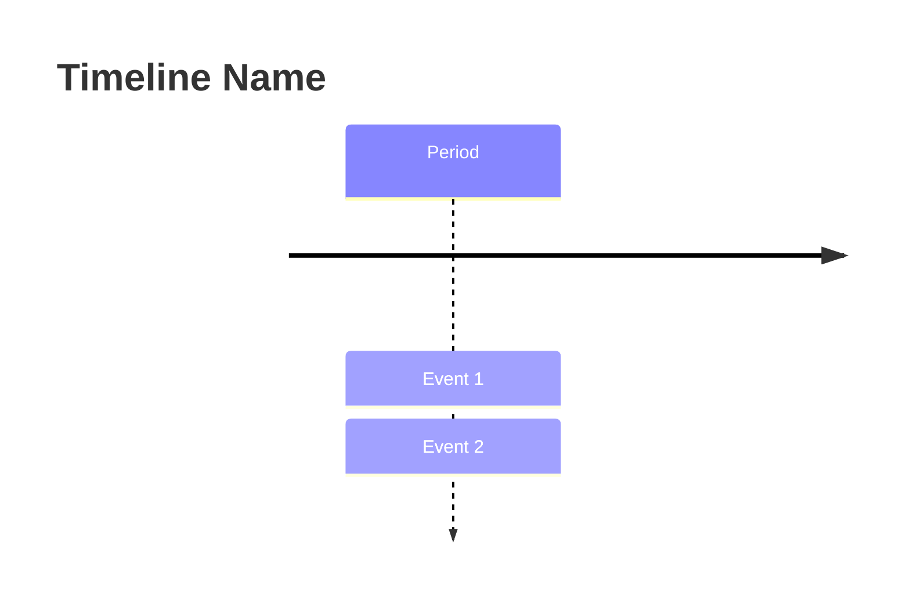
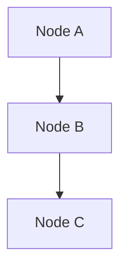

# LF.things Roadmap Visualizations

This guide explains how to view and edit the visual roadmap diagrams for the LF.things project.

## 📁 Files

- `ROADMAP.md` - Main roadmap document with embedded Mermaid diagrams
- `roadmap-visual.mmd` - Standalone Mermaid file with all diagrams

## 🎨 Viewing the Diagrams

### Option 1: GitHub (Easiest)
GitHub automatically renders Mermaid diagrams in markdown files. Just view `ROADMAP.md` on GitHub and the diagrams will display.

### Option 2: Mermaid Live Editor (Best for editing)
1. Go to [https://mermaid.live](https://mermaid.live)
2. Copy the content from `roadmap-visual.mmd`
3. Paste into the editor
4. View and edit in real-time
5. Export as PNG, SVG, or PDF

### Option 3: VS Code Extensions
Install one of these extensions:
- **Markdown Preview Mermaid Support** by Matt Bierner
- **Mermaid Preview** by Mermaid
- **Markdown Preview Enhanced** by Yiyi Wang

Then open `ROADMAP.md` and use the preview pane (Ctrl+Shift+V or Cmd+Shift+V).

### Option 4: Mermaid CLI (For automation)
```bash
# Install Mermaid CLI
npm install -g @mermaid-js/mermaid-cli

# Generate PNG
mmdc -i docs/roadmap-visual.mmd -o docs/roadmap.png

# Generate SVG
mmdc -i docs/roadmap-visual.mmd -o docs/roadmap.svg

# Generate PDF
mmdc -i docs/roadmap-visual.mmd -o docs/roadmap.pdf
```

## 📊 Available Diagrams

### 1. Gantt Chart - Timeline View
Shows the development phases over time with start/end dates. Great for understanding the overall timeline and phase overlaps.

**Use case**: Project planning, stakeholder presentations

### 2. Timeline - Feature Evolution
Displays major features grouped by quarter. Easier to read than Gantt for high-level overview.

**Use case**: Quick reference, documentation

### 3. Feature Dependency Graph
Shows how completed features lead to future enhancements. Helps understand technical dependencies.

**Use case**: Technical planning, architecture decisions

### 4. Phase Breakdown
Detailed view of features within each phase.

**Use case**: Sprint planning, feature prioritization

### 5. Priority Matrix
Quadrant chart showing effort vs impact for features.

**Use case**: Deciding what to build next, resource allocation

## ✏️ Editing the Diagrams

### Gantt Chart Syntax
```mermaid
gantt
    title Project Name
    dateFormat YYYY-MM
    section Section Name
    Task Name    :done/active/crit, id, start-date, end-date
```

### Timeline Syntax


### Graph Syntax


### Quadrant Chart Syntax
```mermaid
quadrantChart
    title Chart Name
    x-axis Label 1 --> Label 2
    y-axis Label 3 --> Label 4
    Item Name: [x-value, y-value]
```

## 🎨 Customization

### Colors
- Green (#90EE90): Completed features
- Gold (#FFD700): Active development
- Light colors: Future phases

### Styling
Add custom styles with:
```mermaid
style NodeID fill:#color,stroke:#color,color:#textcolor
```

## 📤 Exporting

### For Presentations
1. Use Mermaid Live Editor
2. Click "Actions" → "Export"
3. Choose PNG or SVG
4. Use in PowerPoint, Google Slides, etc.

### For Documentation
Keep diagrams in markdown - they'll render automatically on GitHub, GitLab, and most documentation platforms.

### For Print
Export as PDF using Mermaid CLI or print from Mermaid Live Editor.

## 🔄 Updating the Roadmap

When updating the roadmap:

1. Edit `roadmap-visual.mmd` first (easier to work with)
2. Test in Mermaid Live Editor
3. Copy updated diagrams to `ROADMAP.md`
4. Commit both files
5. Verify rendering on GitHub

## 🆘 Troubleshooting

### Diagram not rendering
- Check syntax with Mermaid Live Editor
- Ensure code blocks use ```mermaid
- Verify no special characters breaking syntax

### Dates not displaying correctly
- Use YYYY-MM format for Gantt charts
- Ensure dateFormat matches your date strings

### Styling not working
- Check node IDs match exactly
- Verify color codes are valid hex

## 📚 Resources

- [Mermaid Documentation](https://mermaid.js.org/)
- [Mermaid Live Editor](https://mermaid.live)
- [Mermaid Syntax Guide](https://mermaid.js.org/intro/syntax-reference.html)
- [GitHub Mermaid Support](https://github.blog/2022-02-14-include-diagrams-markdown-files-mermaid/)

---

*Last Updated: April 18, 2026*
