# LF App Feature Flowcharts

This document contains Mermaid.js flowcharts for all major features in the LF (Lost & Found) application.

## 🖨️ Need to Print These?

For printing, use the **print-optimized Graphviz versions** instead:
- Location: `docs/graphviz/print-*.dot`
- Features: 40% larger fonts, 2x thicker lines, simplified labels
- Best for: Printing, presentations, handouts
- Guide: See `docs/PRINTING_FLOWCHARTS_GUIDE.md`

**Quick Start**: Use `print-00-overview.dot` for a single-page overview perfect for printing!

---

## 1. Authentication & Registration Flow

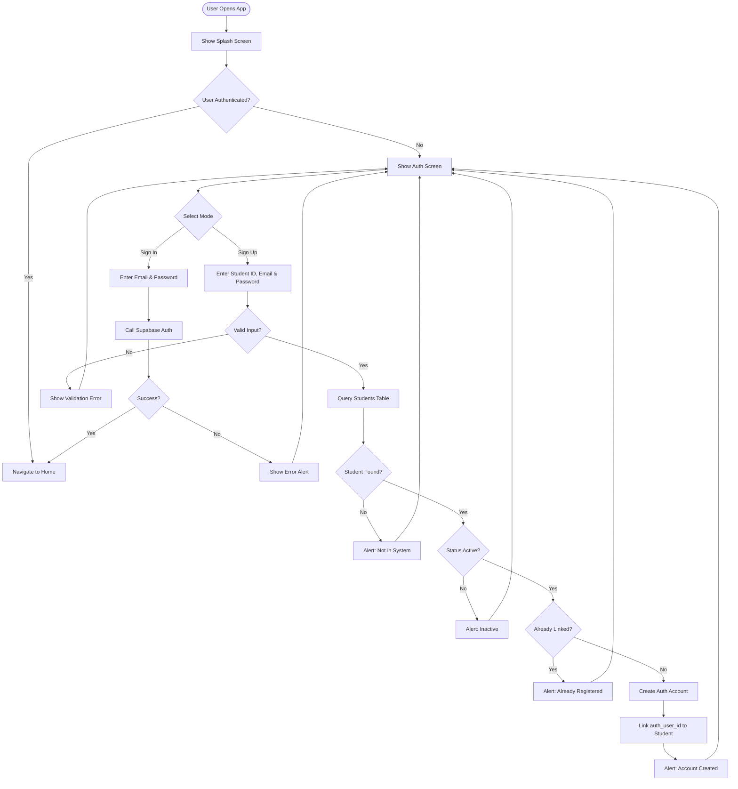

## 2. Item Registration Flow

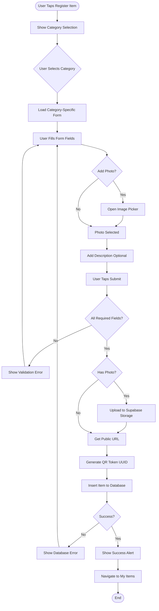

## 3. QR Code Scanning Flow

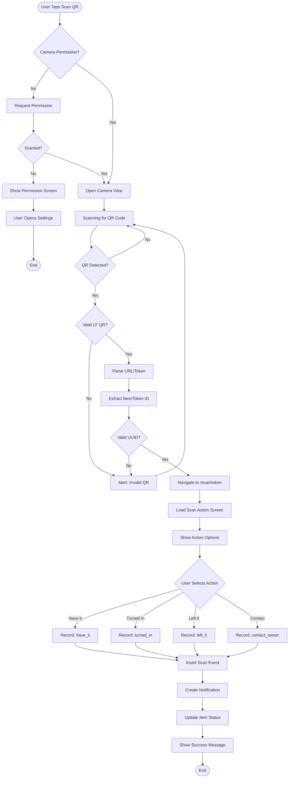

## 4. Report Found Item Flow

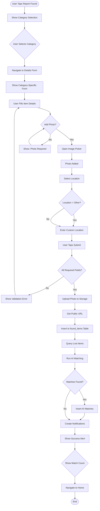

## 5. AI Matching System Flow

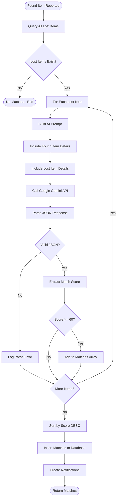

## 6. Match Review & Confirmation Flow

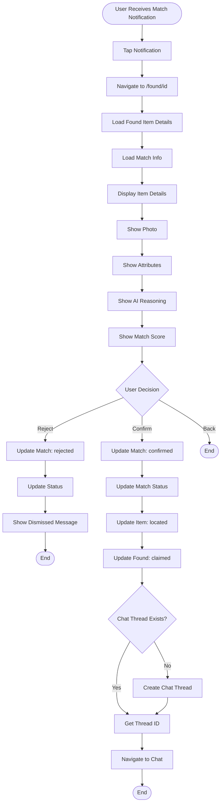

## 7. Chat/Messaging Flow

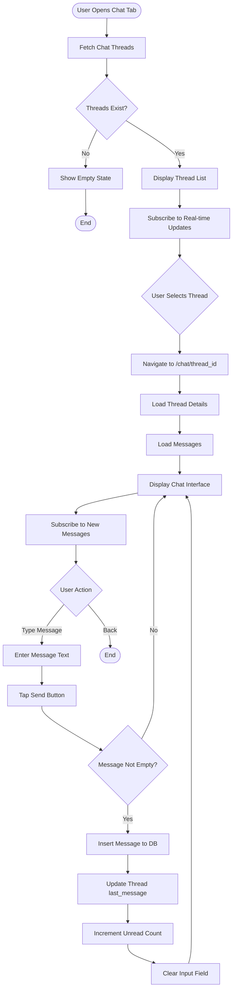

## 8. My Items Management Flow

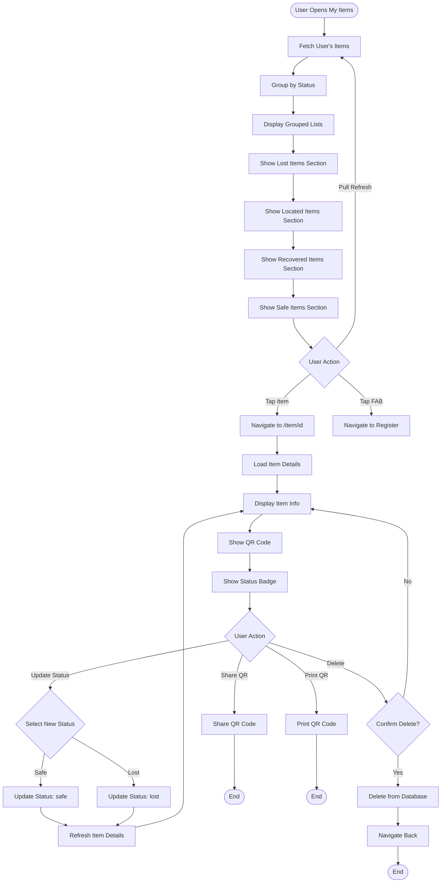

## 9. Notifications/Alerts Flow

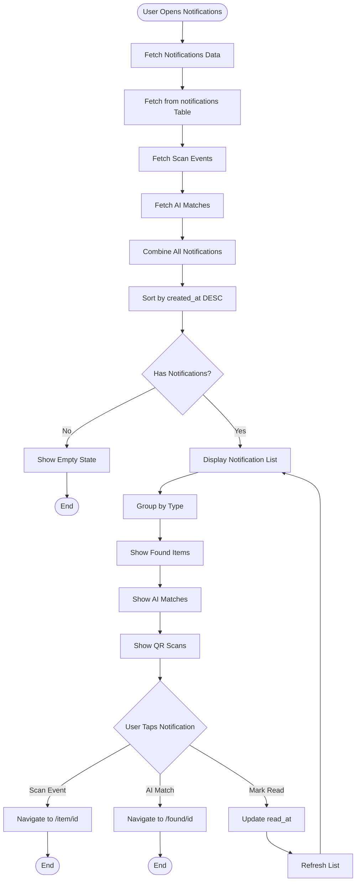

## 10. Admin Dashboard Flow

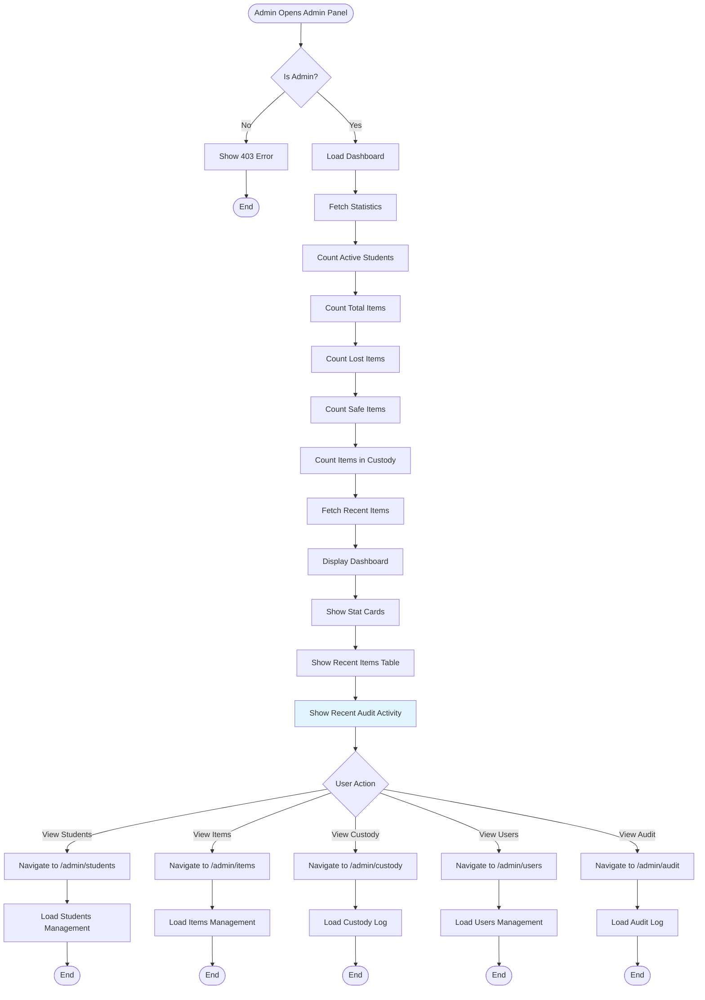

## 11. Student Management (Admin) Flow

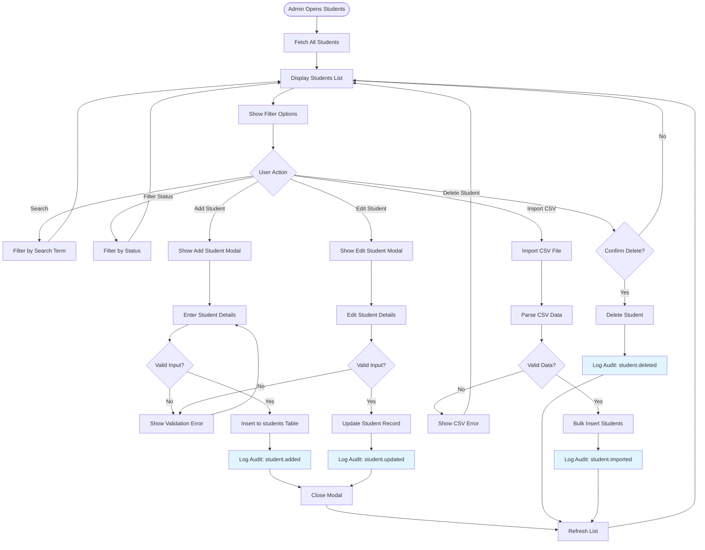

## 12. Custody Log (Admin) Flow

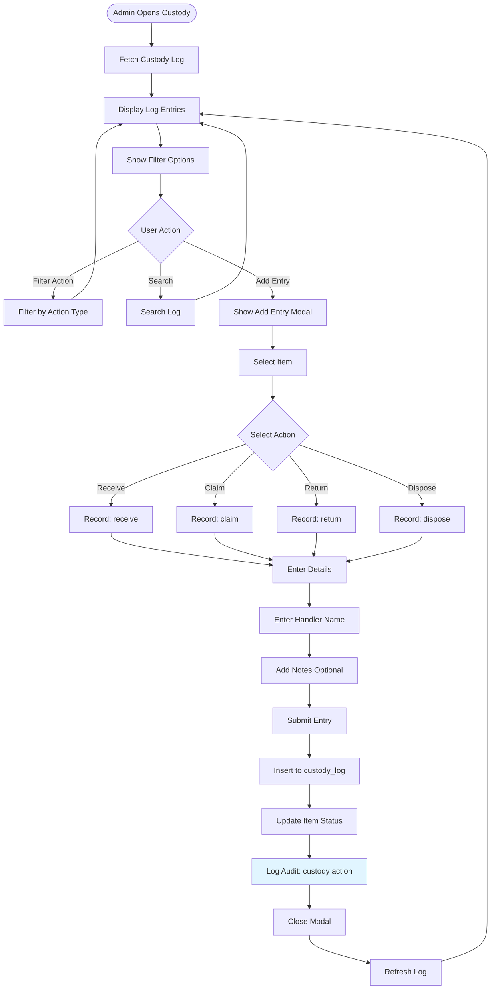

## 13. Profile & Settings Flow

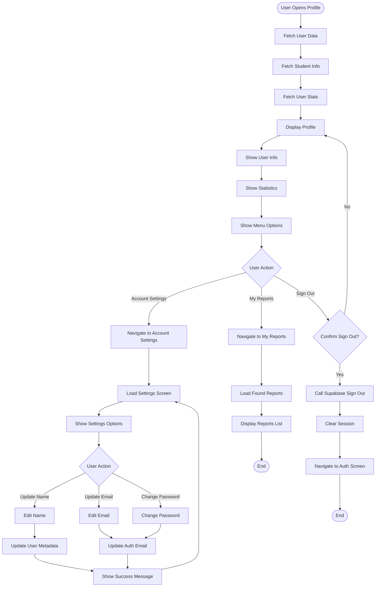

## 14. Home Dashboard Flow

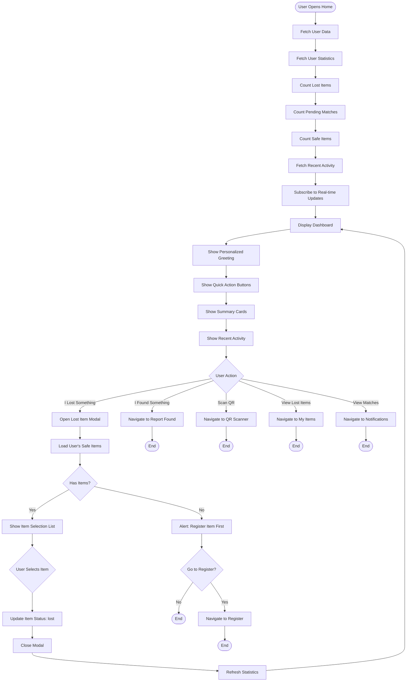

---

## How to Use These Flowcharts

1. **Copy any flowchart** from above
2. **Paste into Mermaid Live Editor**: https://mermaid.live/
3. **Or use in Markdown**: Most modern markdown viewers support Mermaid syntax
4. **GitHub/GitLab**: These platforms render Mermaid diagrams automatically

## Legend

- **Rectangles**: Process/Action steps
- **Diamonds**: Decision points
- **Rounded rectangles**: Start/End points
- **Arrows**: Flow direction
- **Colors**: Auto-generated by Mermaid

