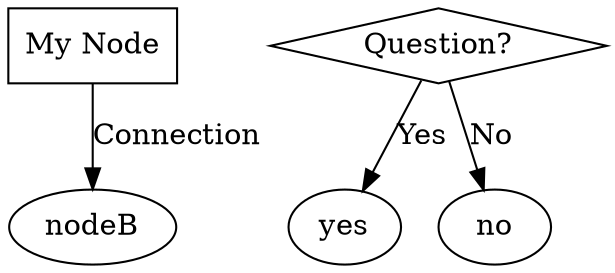

# Graphviz Flowcharts for LF App

This directory contains Graphviz DOT files for all major features in the LF (Lost & Found) application.

## 📁 Files

1. **01-authentication.dot** - Authentication & Registration Flow
2. **02-item-registration.dot** - Item Registration Flow
3. **03-qr-scanning.dot** - QR Code Scanning Flow
4. **04-report-found.dot** - Report Found Item Flow
5. **05-ai-matching.dot** - AI Matching System Flow
6. **06-match-review.dot** - Match Review & Confirmation Flow
7. **07-chat-messaging.dot** - Chat/Messaging Flow
8. **08-my-items.dot** - My Items Management Flow
9. **09-notifications.dot** - Notifications/Alerts Flow
10. **10-admin-dashboard.dot** - Admin Dashboard Flow
11. **11-student-management.dot** - Student Management (Admin) Flow
12. **12-custody-log.dot** - Custody Log (Admin) Flow
13. **13-profile-settings.dot** - Profile & Settings Flow
14. **14-home-dashboard.dot** - Home Dashboard Flow

## 🎨 How to View

### Option 1: Online Viewer (Easiest)
1. Go to https://dreampuf.github.io/GraphvizOnline/
2. Copy the content of any `.dot` file
3. Paste into the editor
4. View the rendered diagram

### Option 2: VS Code Extension
1. Install "Graphviz Preview" extension
2. Open any `.dot` file
3. Press `Ctrl+Shift+V` (or `Cmd+Shift+V` on Mac)

### Option 3: Command Line (Local Installation)
```bash
# Install Graphviz
# macOS
brew install graphviz

# Ubuntu/Debian
sudo apt-get install graphviz

# Windows
choco install graphviz

# Generate PNG
dot -Tpng 01-authentication.dot -o 01-authentication.png

# Generate SVG
dot -Tsvg 01-authentication.dot -o 01-authentication.svg

# Generate PDF
dot -Tpdf 01-authentication.dot -o 01-authentication.pdf
```

### Option 4: Graphviz Online
- https://graphviz.org/
- https://edotor.net/
- https://viz-js.com/

## 🎯 Color Legend

- **Light Blue** - Process/Action steps
- **Light Yellow** - Decision points (diamonds)
- **Light Green** - Start points (ellipses)
- **Pink** - End points (ellipses)
- **Light Coral** - Error/Alert states
- **Light Cyan** - External API calls

## 📊 Export Formats

Graphviz supports multiple output formats:

- **PNG** - Raster image (good for presentations)
- **SVG** - Vector image (scalable, good for web)
- **PDF** - Document format (good for printing)
- **DOT** - Source format (editable)

## 🔧 Customization

You can customize the diagrams by editing the `.dot` files:

```dot
// Change colors
node [fillcolor=lightgreen];

// Change shapes
node [shape=box];        // Rectangle
node [shape=diamond];    // Diamond
node [shape=ellipse];    // Oval
node [shape=circle];     // Circle

// Change direction
rankdir=TB;  // Top to Bottom
rankdir=LR;  // Left to Right

// Change edge labels
A -> B [label="Yes"];
```

## 📝 Syntax Reference



## 🚀 Quick Start

1. Choose a flowchart file (e.g., `01-authentication.dot`)
2. Open https://dreampuf.github.io/GraphvizOnline/
3. Copy and paste the file content
4. View the rendered diagram
5. Export as PNG/SVG if needed

## 📚 Resources

- [Graphviz Documentation](https://graphviz.org/documentation/)
- [DOT Language Guide](https://graphviz.org/doc/info/lang.html)
- [Node Shapes](https://graphviz.org/doc/info/shapes.html)
- [Color Names](https://graphviz.org/doc/info/colors.html)

## 💡 Tips

- Use `rankdir=LR` for wide diagrams
- Use `rankdir=TB` for tall diagrams
- Add `fontname="Arial"` for better readability
- Use `style="rounded,filled"` for modern look
- Group related nodes with subgraphs

## 🔄 Comparison with Mermaid

| Feature | Graphviz | Mermaid |
|---------|----------|---------|
| Syntax | DOT language | Markdown-like |
| Rendering | Server/Local | Browser-based |
| Customization | Very flexible | Limited |
| GitHub Support | No | Yes |
| Learning Curve | Medium | Easy |
| Output Quality | High | Good |

---

**Note**: These flowcharts complement the Mermaid.js versions in `docs/flowcharts.md`. Use whichever format works best for your needs!
